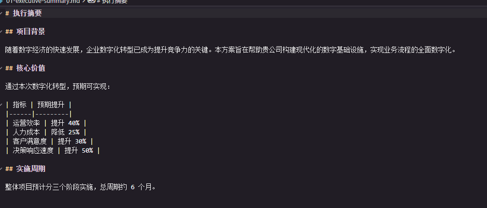

# 概述

## 文档目的

本文档为运维团队提供标准化的技术指南，涵盖系统架构、日常运维、故障处理和应急响应等内容。

## 适用范围

- 生产环境运维
- 测试环境运维
- 开发环境支持

## 文档约定

| 标记 | 含义 |
|------|------|
| ⚠️ | 警告，需特别注意 |
| 💡 | 提示，最佳实践 |
| 🔧 | 操作步骤 |
| 📋 | 检查清单 |

## 联系方式

| 角色 | 联系方式 |
|------|---------|
| 运维值班 | ops@example.com |
| 紧急热线 | 400-XXX-XXXX |
| 钉钉群 | 运维支持群 |

